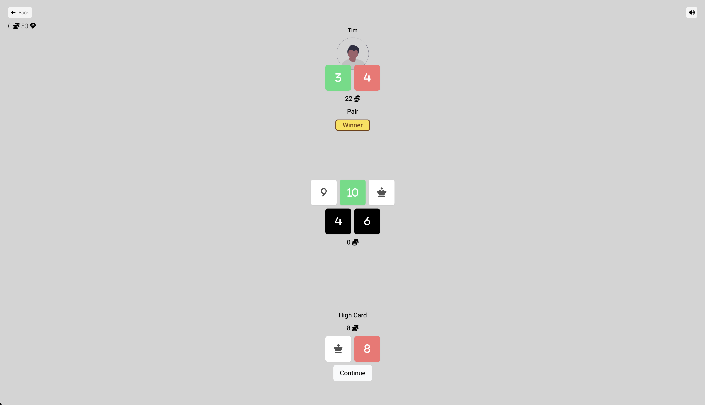
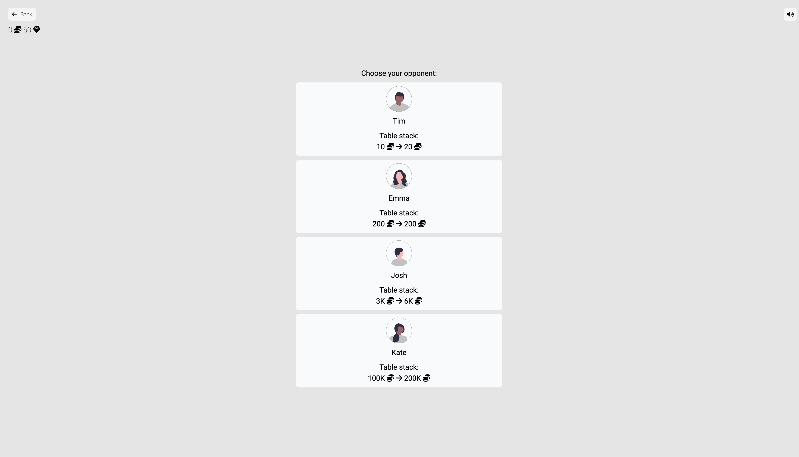
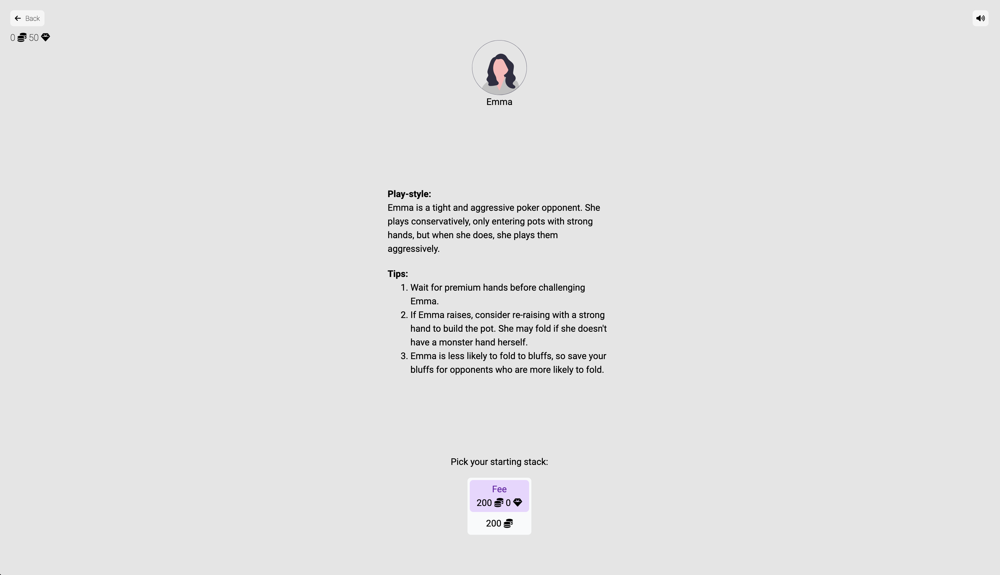

# ♠️ Tiny Poker
*Play Head-Up Texas Hold'Em against bots*

## Description
Tiny Poker is a poker game with a simple, beautiful UI. You can play against bots with a variety of play-styles
or against other players.

## Features
- ♠️ Play Texas Hold'Em locally against bots
- 🤖 Opponent AI changes based on enemy
- 👆 Fast, reactive UI built using Svelte
- 📺 Simple, minimal styles built using TailwindCSS
- 🌐 PVP Multiplyer using Server Side Rendering in Go, HTMX and Websockets
- 📱 Responsive design
- 📊 Observability using custom logs saved to SQLite
- 🚢 Deployable using Docker containers

## Potential Improvements
- ↗️ Hand History using the Open-Hand format
- 👥 Support for bigger tables
- ♣️ Other poker formats

## Development

### Client

1. Build the client
  1. `cd client`
  2. `npm install`
  3. `npm run tailwind`
2. Run `npm run dev`

### PvP Server

1. `cd pvp-server`
2. `go run ./src`

### Landing Page & Analytics

1. `cd server`
2. `go run ./src/main.go`

### Nginx

There are a few services, so there is also a docker compose file that includes all services and an additional Nginx container
that will route traffic accordingly.

## Tech stack
- Svelte
- Tailwind
- Go
- HTMX
- Websockets
- SQLite
- Docker

